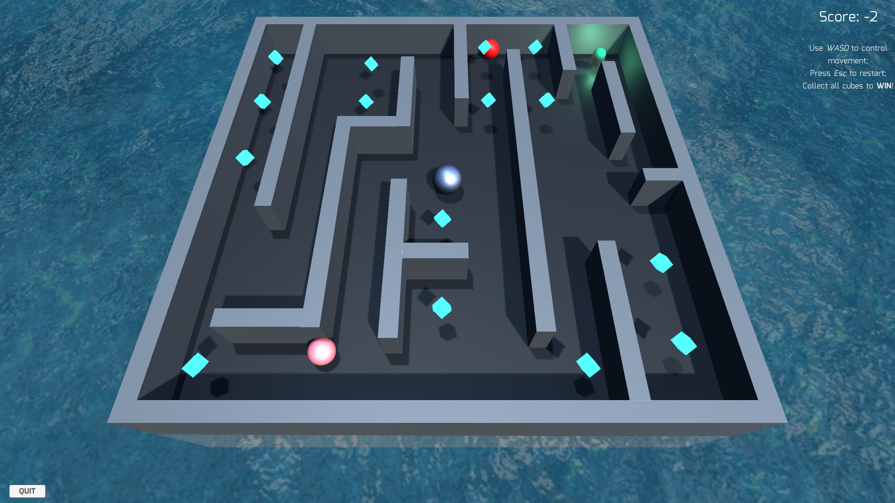

# Unity_Pacman
A demo level of a third-person Pacman game built with Unity and C#

## How to play
Download the <b>PreAlpha_Win.zip</b> file, and run the <b>Maze_PreAlpha.exe</b>. 

## Updates
### 0.0.2
A shader of basic water surface is coded with CG/HLSL and implemented(./Assets/Shaders/Sea_Simple.shader), textures from (https://wallpaperpa.com/hdwallpaper/fantastic-seamless-water-texture.html), movement theory based on (https://developer.nvidia.com/gpugems/GPUGems/gpugems_ch01.html). 

### 0.0.1
Fixed collision failure bug(set collision type to dynamic);
Sound effects added;

### 0.0.0
Game scene built;
Winning/Losing, eating cubes/ghosts/capsules and other essential features implemented;
Collision failure bug exists;
